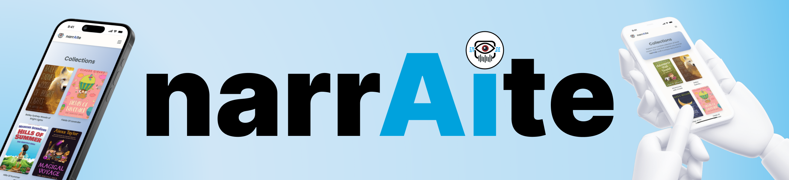

# TC-3202 [narrAIte]



## Table of Contents

- [Introduction](#introduction)
- [Project Overview](#project-overview)
- [Objectives](#objectives)
- [Features](#features)
- [Technologies Used](#technologies-used)
- [Setup and Installation](#setup-and-installation)
- [Usage Instructions](#usage-instructions)
- [Project Structure](#project-structure)
- [Contributors](#contributors)
- [Chagelog](#changelog)
- [Acknowledgments](#acknowledgments)
- [License](#license)

---

## Introduction

Assistive technology is a device, software, or system that helps individuals with disabilities perform functions that might otherwise be difficult or impossible. Therefore, we developed "narrAIte," an assistive technology designed to support and benefit blind people. This innovation aims to enhance accessibility and provide a more inclusive experience, particularly for individuals with visual impairments, by utilizing technology to address their unique needs.

## Project Overview

narrAite automatically creates and narrates stories based on visual inputs by combining text-to-speech and image recognition technology. This enables blind youngsters to interact meaningfully with visual content by converting still images into dynamic audio narratives. It shows how artificial intelligence may be used to develop inclusive digital solutions that provide people with disabilities more authority.

## Objectives

- Develop a solution for [Blind Inclusivity].
- Implement features to [make a story that can be understand by impaired].
- Test and validate [Image to Speech].

## Features

- Accessible: Account is not needed.
- Free Resources: Collections Tab offers series of photos that the user can use.
- Audible: Crafted Stories can be heard loud and clear.

## Technologies Used

- Programming Languages: Python, JavaScript, HTML, TailwindCSS
- Frameworks/Libraries: React, FastAPI
- Databases: Firebase Storage
- Other Tools: MistralAI, CoquiTTS, gTTS

## Setup and Installation

Step-by-step instructions for setting up the project locally.

1. **Clone the repository:**
   ```bash
   git clone https://github.com/thebadsektor/tc3202-3a-8.git
   ```
2. **Install dependencies:**
   - If using `npm`:
   ```bash
   cd frontend
   ```
   ```bash
   npm install
   ```
   - If using `pip` (for Python projects):
   ```bash
   cd backend
   ```
   ```bash
   pip install -r requirements.txt
   ```
3. **Configure environment variables (if any)**: Provide instructions for setting up .env files or any other required configurations.
   ```bash
   python3.11 -m venv venv
   ```
   ```bash
   source venv/Scripts/activate
   ```
4. **Run the project:**
   - For web projects:
   ```bash
   npm start
   ```
   - IFor backend services:
   ```bash
   uvicorn main:app --reload
   ```

**Note:** If your project has external depencies like XAMPP, MySQL, special SDK, or other environemnt setup, create another section for it.

## Usage Instructions

- Once the Landing page is shown, Click "Get Started".
- Choose your story language.
- Upload your desired image.
- Optional: The user can choose from our Collections Tab
- Click "Generate" and wait for the process.

## Project Structure

Explain the structure of the project directory. Example:

```bash
.
├── 📂 backend/
│   ├── .gitignore
│   ├── main.py
│   └── requirements.txt
├── 📂 frontend/
│   ├──📂 public/
│   │   ├── Banner.png
│   │   ├── index.html
│   │   ├── LogoWithBorder.svg
│   ├── 📂 src/
│   │   ├── 📂 animations/
│   │   │    └── <animations>
│   │   ├── 📂 assets/
│   │   │    └── <pictures>
│   │   ├── 📂 components/
│   │   │    └── <component>
│   │   ├── 📂 pages/
│   │   │    └── <page>
│   │   ├── 📂 styles/
│   │   │    └── <cssfile>
│   │   └── ...
│   ├── .gitignore
│   └── package-lock.json
│   └── package.json
│   └── postcss.config.js
│   └── tailwind.config.js
└── README.md
```

## Contributors

List all the team members involved in the project. Include their roles and responsibilities:

- **Sam Gabriel Advento**: Lead Developer, Backend Developer
- **Sam Gabriel Advento & Jay Ann Castillo**: Frontend Developer, UI/UX Designer
- **Jay Ann Castillo & Faith Cruz & Carlos Cortez**: Documentators
- **Gerald Villaran**: Course Instructor

## Project Timeline

Outline the project timeline, including milestones or deliverables. Example:

- **Week 1-3 (Feb 3)**: Concept Paper Proposal
- **Week 3-5 (Feb 25)** : Consultation
- **Week 5-6 (March 10)** : Plan User Journey and Refinement
- **Week 7-8 (March 12)** : Research
- **Week 8-9 (March 18)** : Repository Preparation
- **Week 9-10 (March 24)** : Frontend Coding
- **Week 11-14 (March 31)** : Backend Coding and Major to Minor Changes
- **Week 16-18 (April 21)** : Dataset Preparation
- **Week 18 (May 8)** : Model Training
- **Week 19 (May 13)** : Checking

## Changelog

### [Version 1.0.0] - 2025-05-13

- Initial release of the project.
- Added basic functionality for Collections and Upload Section.

## Acknowledgments

Acknowledge any resources, mentors, or external tools that helped in completing the project.

This project was built from [narrAIte](https://github.com/thebadsektor/tc3202-3a-8.git), created by [BSCS-DS 3A Group 8]. You can view the original repository [here](https://github.com/thebadsektor/tc3202-3a-8.git).

## License

Specify the project's license. For starters, adapt the license of the original repository.
